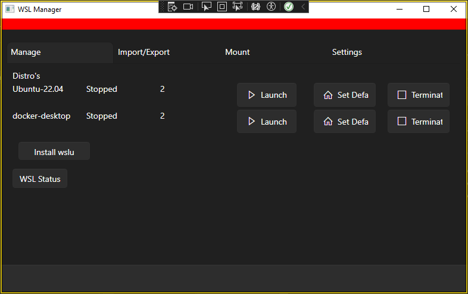
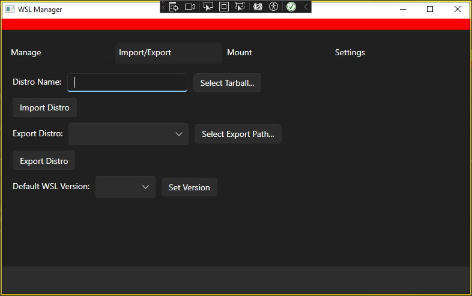
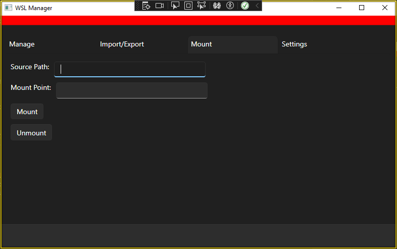

# 🐧 WSL Manager - A GUI for Windows Subsystem for Linux

A modern WPF desktop application for managing WSL (Windows Subsystem for Linux) distributions and settings, built with C# and .NET.



---

## ✨ Features

- Launch default or selected WSL distributions
- List all installed distributions
- Set a default distribution
- Shutdown or terminate specific WSL sessions
- Import a new WSL distro from a `.tar` file
- Export existing distros to `.tar` files
- Mount and unmount paths inside WSL
- Set default WSL version (1 or 2)
- Minimal, clean interface with tabbed navigation

---

## 📸 Screenshots

### 🔧 Main Controls


### 📦 Import/Export


### 📁 Mount Management


---

## NOTES:
- - Commands are executed using wsl.exe under the hood.
- "Launch WSL" requires a distro to be selected — it's disabled otherwise.
- A new terminal window is opened using the selected distro, in its default home path.

---

## 🛠️ Requirements

- Windows 10/11
- WSL enabled
- .NET 9.0 SDK or later
- Visual Studio 2022+ (or any compatible IDE)

---

## 🚀 Getting Started

### Clone and Run

```bash
git clone https://github.com/bacloud22/WSLWpfApp.git
cd wsl-manager
```

---

## LICENCE

MIT License. See LICENSE file for details.

